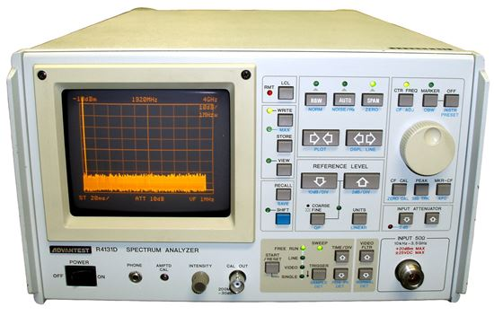
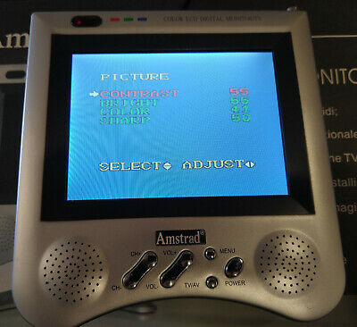
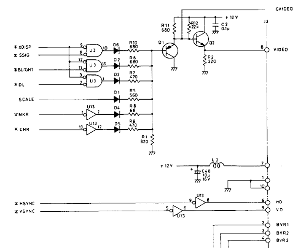

# Advantest R4131D: conversion to color display
This repository contains the resources and description of how I succesfully converted a R4131D spectrum analyzer with a dead monochrome CRT to color salvaging a 6" Amstrad portable LCD TV.
The method used here is applicable to other pieces of equipment which use the same architecture for video generation (Raster + Composite video out) as well as to other types of LCD monitors.
A future modification will involve converting the video output from composite monochrome to color VGA.
## Advantest R4131D Brief Description
According to [user manual](manuals/pdf_mn_ER4131_OPERATING_MANUAL.pdf)
> The R4131 covers a band-width as wide as 10kHz to 3500 MHz and is controlled by a microcomputer. 
> This analyzer features easy confirmation of all measuring conditions, since 
> its frequency span is 4 GHz to 50 kHz, 
> resolution is 1 MHz to 1 kHz, 
> level data resolution by a marker is 0.05 dB, 
> tube surface dynamic range is 80dB, 
> and the setting conditions of its major functions are shown on its CRT display.

(typos have been corrected, grammar has been left to its original form).

According to documentation the "D" version sports
* 100kHz display frequency accuracy on frequencies ≤ 2.5 GHz (AFC block, malfunctioning on my unit 😭)
* POSI/NEG display
* Occupied Bandwidth measurement

The analyzer looks like the following picture (taken from the internet, I have the same but I did not think about taking a picture before removing the CRT)



## How I Got the Analyzer and What Was Wrong
On March 2020 I was lucky enough to obtain from my friend **MrTimes** a R4131D with its tracking generator against the payment of a more than reasonable amount of 💰. The instruments came fully aligned, however the analyzer presented a "narrow display" issue (the trace was compressed vertically, sorry no picture again) and so an external CRT monitor connected to the analyzer rear video output came along.
I started using it in this configuration until July 2021 when all of a sudden the external monitor stopped functioning.
I was able to verify that the problem was due to the external CRT being dead using a VGA→HDMI converter + external HDMI monitor, but this solution was not practical so I decided it was time to fix the issue once for all.

## Troubleshooting
### Root Cause Analysis
The information we have are:
1. the video displayed on CRT is not correct
2. the video displayed on an external monitor using VIDEO OUT is correct

By looking at the block diagram on section 9-4 (page 203) of the [user manual](manuals/pdf_mn_ER4131_OPERATING_MANUAL.pdf), we can see that the CRT and composite video signals are both generated by the same module (CRT CNT):


So it's safe to say that the problem is located on the CRT sub-assembly and not on the logic board. It'll be just a matter of locating the vertical amplifier schematic on the schematic and... no schematic at all for the CRT!

### Finding Another Solution
It was impossible to locate the schematic anywhere on the internet (hey if you have it, drop me a message!), so I started looking for information on the net. Who knows, maybe sobebody had my same problem and found the solution.
After a short google search with the right keywords I came over [this blog post](https://www.eevblog.com/forum/testgear/advantest-r4131d-lcd-display/) where **cizeta59** 
>\[...] Removed old R4131D tube display and replaced with6-inch color LCD screen taken from Amstrad T6 TV with video input \[...]

Bingo! I was able to exchange with him and he wes so kind to give me his notes on the modification and the authorization to puglish this guide.
The modification consists **in removing the old CRT assembly, building a diode multiplexer to generate R, G and B signals and then feed the signals to an old Amstrad T6 6" color LCD television** 



I was able to find an Amstrad T6 for a whopping 45€ and I jumped on it, however any other [LA76810]()-based monitor would follow the same procedure.

### How the Video Signal is Constructed
The video displayed on the CRT is generated directly by the CPU in form of a [raster signal]'https://en.wikipedia.org/wiki/Raster_scan):
* Horizontal and Vertical Synchonization pulses ```*HSYNC``` and ```*VSYNC``` inverted by U13 and fed as ```HD``` and ```VD``` on pins 6 and 9 of J8
* The information (display signal, marker, scale, etc.) is fed to a 6 diodes multiplexer (D1 - D6) to an amplifier (Q1 - Q2) and becomes ```VIDEO``` signal, fed to the video input of CRT (J8 pin 8)



Basically ```*HSYNC``` signals gives the tempo for the orizontal movement of the brush on each line while ```*VSYNC``` controls he jump from line to line. The ```VIDEO``` signal controls whether or not the brush draws a pixel. As everything is synchrinized by the same timebase, we get a meaningful image

The ```VIDEO``` information is used to build a [composite video output](https://en.wikipedia.org/wiki/Composite_video) accessible from the rear panel trough a BNC:


This amplifier combines ```OSYNC``` signal (created by U23 and producing horizontal and vertical sync pulses) with ```OVIDEO``` (luminance level) into an amplitude modulated signal fed through J7 to the rear panel.

For an in depth digression on how composite video, check out this [tech tip from SENCORE](manuals/TT148-4053.pdf)
